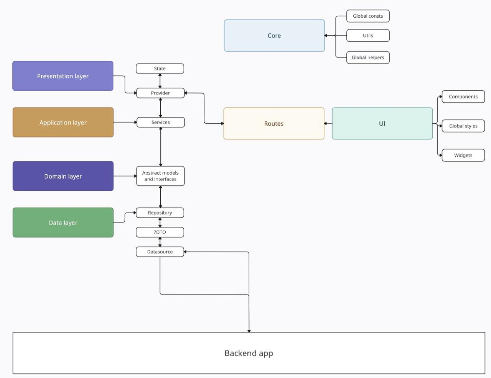

# Preton telegram mini-app game v2

## Technologies

Nuxt 3 + Vue 3, typescript, scss, husky, commitizen + git-cz, npm package manager

## Installation

```
#install dependencies
npm i
```

## Environment variables

```
#dev
PUBLIC_BACK_API_URL="backend api-url"
PUBLIC_FRONT_URL="frontend-api-url"
```

## Dev

```
#dev
npm run dev
```

## Build

```
#build
npm run build
```

## Code style, typechecking and formatting

```
#typecheck
npm run check
#lint
npm run lint
#lint + format (prettier)
npm run format
```

## Work with repo

```
#do not use IDE to commit your changes
git add .
#commit with git-cz + commitizen
npm run commit
#after checking your code with husky (ts check and lint) you can push
git push
```

## Architecture

<a href="https://drive.google.com/file/d/1rd76E0uF7OQbsAF4ZRKvWsdtFAWRvVCH/view?usp=sharing" target="_blank">
    
</a>
